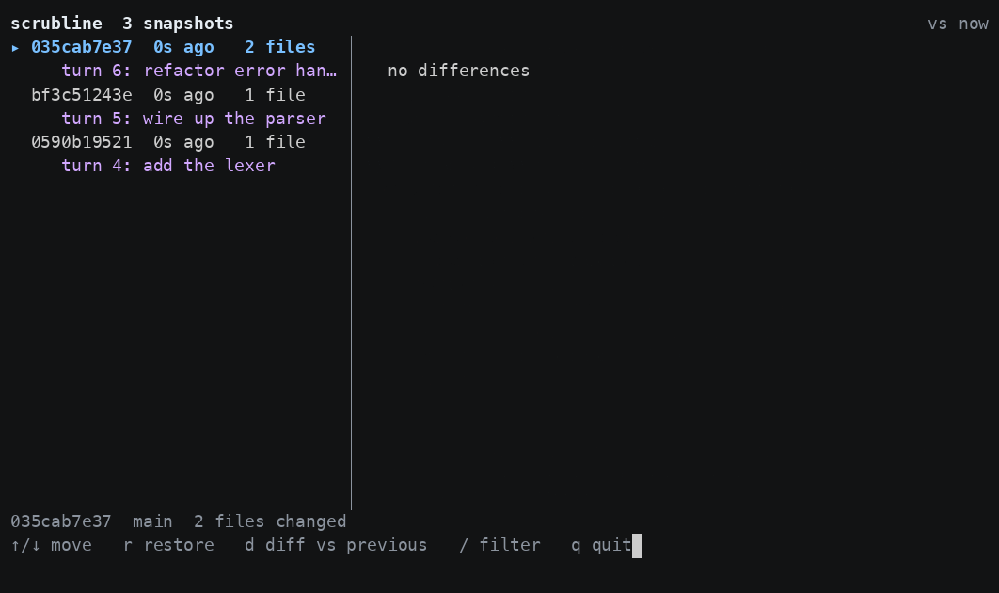

# scrubline

**An undo timeline for the working tree your agent is editing.**

Your agent was right three turns ago. Then it kept going, and now twelve files
are wrong and `git` has one messy WIP commit from an hour back. `Ctrl-Z` means
nothing across twelve files. `git stash` is not a time machine.

`scrubline` runs a tape deck over your working tree: it records a snapshot every
time you stop typing, and lets you wind back to any point and play from there.



```
$ scrubline watch
recording /home/you/project -- press Ctrl-C to stop
9f2c1a4b3e  0s ago    main          3 files
a71e04cc12  0s ago    main          1 file   turn 7: extract the parser

$ scrubline list
a71e04cc12  2m ago    main          1 file   turn 7: extract the parser
9f2c1a4b3e  6m ago    main          3 files
1b90ffe217  11m ago   main          2 files

$ scrubline restore 9f2c1a4b3e
restored 9f2c1a4b3e
  modify  src/parser.go
  delete  src/parser_v2.go
  add     src/lexer.go

the previous state is snapshot 4d1c0ba996 -- `scrubline restore 4d1c0ba996` puts it back
```

## Install

```sh
curl -fsSL https://raw.githubusercontent.com/nathanz3491/scrubline/main/install.sh | sh
```

A single static binary with no runtime to install first, for macOS and Linux on
both Intel and ARM, plus Windows on Intel. Or:

```sh
go install github.com/nathanz3491/scrubline@latest     # if you have Go
```

```sh
brew install nathanz3491/tap/scrubline                 # once the tap is published
```

Or download a binary from [the releases page](https://github.com/nathanz3491/scrubline/releases).

Uninstall is `rm ~/.local/bin/scrubline`. Snapshots live inside the repository
they belong to; `git update-ref -d refs/scrubline/timeline` removes them, and
`git gc --prune=now` reclaims the space.

## Use

```sh
scrubline watch                 # record continuously while you work
scrubline                       # browse the timeline
scrubline snap -m "before the refactor"
scrubline list                  # what have I got?
scrubline show <id> --files     # what did that snapshot change?
scrubline restore <id>          # put the tree back
scrubline restore <id> --dry-run --path src/parser.go
scrubline prune --older-than 7d # drop old snapshots
```

Leave `scrubline watch` running in a spare terminal while your agent works. A
burst of edits becomes one snapshot, not thirty.

### The browser

`scrubline` with no arguments opens the timeline: snapshots on the left, the
diff on the right.

| Key | |
|---|---|
| `↑` `↓` | move between snapshots |
| `r` | restore the selected snapshot, after a confirmation |
| `d` | toggle the diff between *vs now* and *vs previous* |
| `/` | filter snapshots by filename or label |
| `q` | quit |

`PgUp` / `PgDn` scroll a long diff. Colours adapt to light and dark terminals
and disappear entirely under `NO_COLOR`. Narrower than 56 columns the diff pane
is dropped rather than squeezed.

### For agent hooks

`scrubline mark "<label>"` labels a snapshot, so a timeline reads as *turns*
rather than as saves. It is deliberately agent-agnostic: anything that can run a
command at a turn boundary can call it.

```sh
scrubline mark "turn $N: $USER_PROMPT"
```

## How it works

A snapshot is an ordinary git commit on a hidden ref, `refs/scrubline/timeline`,
staged through a private index file. That means:

- **It costs almost nothing.** Git already deduplicates and compresses; an
  unchanged file is stored once no matter how many snapshots contain it.
- **It cannot disturb your work.** Your index, `HEAD`, branches, and stashes are
  never touched. `git status` reads exactly the same before and after a snapshot.
- **It is not pushed anywhere.** The ref is local, outside `refs/heads`, so it
  does not travel with `git push` and does not appear in your branch list.
- **Diffing is free**, because everything is already a git object.

## What it will not do to you

Restore is the dangerous direction, so:

- **Every restore snapshots the current tree first.** The id is printed, and
  restoring it puts back every file scrubline manages. If a restore cannot be
  applied cleanly it is refused before anything is written, and on the rare
  failure that only shows up mid-write, the id you need is printed along with a
  plain statement that the tree is partly rewritten.
- **What git ignores right now, scrubline does not touch** -- it is not
  recorded, not written, and not deleted. Your `node_modules/`, your `.env`,
  your build output, and your local database are not part of this. The rule is
  read fresh every time and applied in both directions, so ignoring a file is
  enough to keep it out of scrubline's way from that moment on, including files
  that were snapshotted before you ignored them.
- **A plan that cannot be applied is refused whole.** A file that is now a
  directory, a read-only file, an unwritable directory: all of them stop the
  restore before the first write, list every problem at once, and leave the
  timeline clean -- no half-rewritten tree, and no safety snapshot minted for an
  attempt that did not happen.
- **`--dry-run` shows the exact file-level plan** and touches nothing.
- **A `--path` that matches nothing is an error**, not a quiet success.
- **Nothing happens without a git repository.** `scrubline` refuses to run
  outside one rather than guessing what your project is.

## Known limits

These are real and worth knowing before you rely on restore:

- **Git LFS and custom clean filters.** Snapshots stage through `git add`, which
  runs your `.gitattributes` clean filter, and restore writes the stored blob
  back without the matching smudge filter. For LFS-managed paths that means a
  restore can replace a file with its pointer, and the safety snapshot holds the
  same pointer. `git lfs checkout` recovers the real content. If you use LFS or
  a custom clean filter, do not restore over those paths.
- **Windows line endings.** With `core.autocrlf=true` -- the Git for Windows
  default -- a CRLF file is stored as LF and restored as LF, so `git status`
  will show restored files as modified. Restore is byte-identical on macOS and
  Linux; on Windows it is line-ending-normalised.
- **Ignore rules are current, not historical.** Because the ignore decision is
  always "what does git ignore right now", a snapshot is not guaranteed to
  reproduce your directory exactly if your ignore rules changed in between. The
  contract is that restore puts back the files scrubline manages -- not that it
  recreates your directory. The alternative would mean writing a secret back
  over a file you had just decided to ignore, which is worse.
- **Submodules are left alone.** A submodule pointer is never restored.

## Storage

Snapshots are git objects, so an unchanged file costs nothing no matter how many
snapshots contain it -- only what actually changed is stored, compressed. A
deliberately hostile measurement: 30 snapshots over a 40-file repository, each
one rewriting eight files with 20KB of fresh random text, came to 1.34 MiB. Real
editing sessions share far more between snapshots than that.

When it does get large:

```sh
scrubline prune --older-than 7d   # unlink old snapshots, always keeping the newest
git gc --prune=now                # reclaim the space
```

`prune` deliberately stops at unlinking. `git gc` prunes every unreferenced
object in your repository, not only scrubline's, and that is not a decision this
tool should make for you.

## Notes

- Pruning rebuilds the snapshots it keeps, so their ids change. Trees, labels,
  and timestamps do not.
- Don't point `scrubline watch`'s own output at a file inside the repository it
  is watching: each snapshot writes a log line, which is a change, which
  triggers the next snapshot.
- Opening the browser links in a terminal UI library that probes the terminal
  for its background colour at startup, so every command emits a short escape
  sequence before it runs. Terminals answer it instantly; it is invisible in
  normal use.

## Requirements

`git` on your `PATH`, and a git repository. That is all.

## License

MIT. See [LICENSE](LICENSE).
